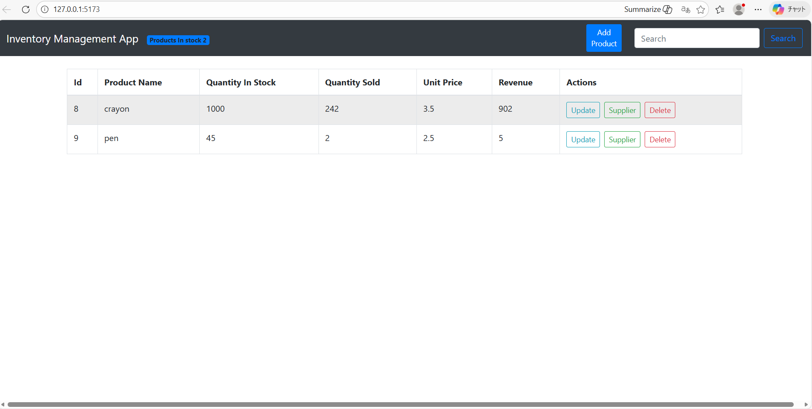
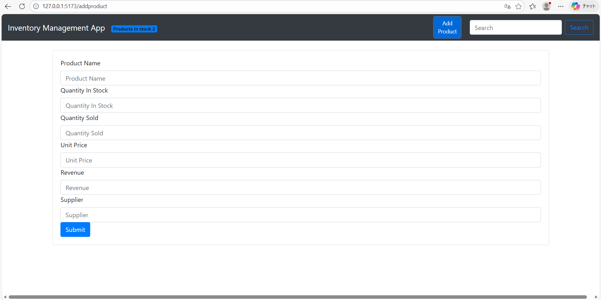

# 在庫管理システム (Inventory Management System)

## 1. 導入セクション（Introduction）

学習用にプロジェクトとして開発している、FastAPI と React を使った在庫管理アプリケーションである。  

### 説明　(Description)

#### プロジェクト全体について　(About the Project)

本プロジェクトの目的はフルスタック開発の流れを学ぶことである。そのため、確実な動作を保証するためコードはチュートリアルに忠実にそって作成されている。  

また本プロジェクトで得た知識を応用して、別でオリジナルのポーカー収支管理プロジェクトを作成した。  

#### アプリケーションについて　(About the Application)

本アプリケーションにおける主要機能と重要概念は以下の通りである：

- **外部キーを用いたデータベースの関連付け:** 各在庫商品は仕入れ先とsupplier_idを用いて関連付けされる。
- **CRUD操作:** フロントエンドを経由して商品データベースでの商品の作成(Create)、読み取り(Read)、更新(Update)、削除(Delete)が可能。
- **部品単位のUI設計:** UIはReactの部品を使用して構築されており、コードベースのメンテナンスと拡張がより容易になっている。
- **データの非同期処理：** FastAPIの非同期（async）機能を、サーバーをブロックすることなくデータベース操作（特にクエリ）を処理するために使用。  

#### スクリーンショット
| ホーム画面（商品データ表示） | 商品追加ページ |
| :---: | :---: |
|  |  |  

## 2. セットアップと実行方法 (Setup & Usage)

### 技術スタック (Tech Stack)

#### Backend

- **Framework**: FastAPI
- **ORM**: Tortoise-ORM
- **Database**: SQLite
- **Security**: python-dotenv, CORS Middleware  

#### Frontend

- **Framework**: React (Vite)
- **Styling**: Bootstrap 4.6, React-Bootstrap
- **Routing**: React Router Dom  

### 環境・動作要件　(Environment & Compatibility)

教材とは異なり各バージョンの最新バージョンを使用しました。

* **開発OS**: Windows 11 (via WSL2 / Ubuntu 24.04)
* **Python**: 3.12.3
* **主要なライブラリ**:
    * `fastapi==0.128.0`
    * `pydantic==2.12.12`
    * `uvicorn==0.40.0`
* *詳しい内容は `requirements.txt`から確認できます。*  

### コマンド　(Step-by-step Guide)

#### 1. Backend

1. ターミナルを開いてバックエンドディレクトリに移動
2. 仮想環境の構築と実行
3. 依存関係をインストール
4. サーバーの起動  

```bash
cd backend
python -m venv venv
source venv/bin/activate
pip install -r requirements.txt
uvicorn app:app --reload
```  

#### 2. Frontend

1. ターミナルを開いてフロントエンドディレクトリに移動
2.  NPMパッケージをインストール
3. サーバーの起動  

```bash
cd front_end
npm install
npm run dev
```  

### ディレクトリ構成 (Project Structure)

```text
inventory-app
├── README.md
├── backend/
│   ├── .env.example            # Sample environment
variables
│   ├── app.py
│   ├── models.py               # Database models
│   ├── requirements.txt
├── dev_log.md                  # Development diary
└── front_end/
    ├── index.html
    ├── package.json
    ├── src/                    # React component
    └── vite.config.js          # VIte configuration
```  
## 3. プロジェクトの管理情報　(Project Management Information)

### ライセンス　(License)

このプロジェクトはMITライセンスの下で公開されています。詳細はLICENSEファイルをご覧ください。  

### 参考教材　(Acknowledgments)

このプロジェクトは、YouTubeのチュートリアルを参考に学習目的で作成されました。

- **チュートリアル動画:** FastAPI and React - Code With Prince (https://youtube.com/playlist?list=PLU7aW4OZeUzwYXbC_mbQJdAU7JUu81RZo&si=e5AzozGGDrv-GDW8)

- **オリジナルソースコード:** InventoryManagementSeries - Princekrampah (https://github.com/Princekrampah/InventoryManagementSeries)  

### コンタクト　(Contact)

TeruyaY - https://github.com/TeruyaY